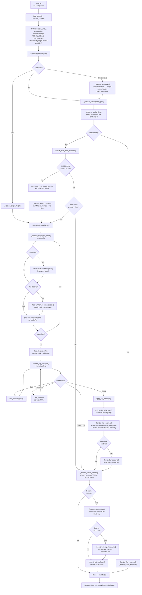

# ID3 Manager — App Flows

```mermaid
flowchart TD
    CLI["main.py\nCLI / argparse"] --> Config["load_config() + validate_config()"]
    Config --> Init["ID3Processor.__init__\nID3Handler · FolderManager\nACRCloudClient · DiscogsClient\nOneDriveSync (if --mirror-onedrive)"]
    Init --> Process["processor.process(path)"]

    Process --> PathType{Path type?}
    PathType -->|file| SingleFile["_process_single_file(file)"]
    PathType -->|dir, recursive| Recursive["_process_recursive()\nrglob audio files → unique parent folders\nfilter by --start-at"]
    PathType -->|dir| ProcessFolder

    Recursive --> ProcessFolder["_process_folder(folder_path)"]
    SingleFile --> ProcessFiles

    ProcessFolder --> DiscoverFiles["discover_audio_files()\nread current tags via ID3Handler"]
    DiscoverFiles --> RenameOnly{--rename-only?}

    RenameOnly -->|yes| RenameFlow["_handle_file_renames()\n_handle_folder_rename()"]
    RenameOnly -->|no| DetectDisc["detect_multi_disc_structure()"]

    DetectDisc --> MultiDisc{Multiple disc\nfolders found?}
    MultiDisc -->|yes| NormalizeDiscs["normalize_disc_folder_name()\nfor each disc folder"]
    NormalizeDiscs --> ProcessEachDisc["_process_disc() × N discs\nbackfill disc_number onto files"]
    ProcessEachDisc --> ProcessFiles
    MultiDisc -->|no| NeedWork{Files need\nwork or --force?}
    NeedWork -->|no| FolderRename
    NeedWork -->|yes| ProcessFiles

    ProcessFiles["process_files(audio_files)"] --> PerFile["_process_single_file_obj(af)\nfor each file"]
    PerFile --> ACR{--skip-acr?}
    ACR -->|no| ACRCloud["ACRCloudClient.recognize()\nfingerprint match"]
    ACR -->|yes| DiscogsStep
    ACRCloud --> DiscogsStep{--skip-discogs?}
    DiscogsStep -->|no| DiscogsSearch["DiscogsClient.search_release()\nmatch track from release"]
    DiscogsStep -->|yes| ProposeTags
    DiscogsSearch --> ProposeTags["populate proposed_tags\non AudioFile"]
    ProposeTags --> MoreFiles{More files?}
    MoreFiles -->|yes| PerFile
    MoreFiles -->|no| PostProcess

    PostProcess["backfill_disc_info()\ndetect_track_collisions()"] --> Confirm

    Confirm["confirm_tag_changes()\ninteractive loop"] --> Choice{User choice}
    Choice -->|Edit| EditFile["edit_collision_files()"]
    EditFile --> Confirm
    Choice -->|Album Edit| EditAlbum["edit_album()\nacross all files"]
    EditAlbum --> Confirm
    Choice -->|Skip / Quit| FolderRename
    Choice -->|Apply| ApplyTags

    ApplyTags["apply_tag_changes()"] --> WriteID3["ID3Handler.write_tags()\npreserve existing tags"]
    WriteID3 --> FileRenames["_handle_file_renames()\nFolderManager.rename_audio_file()\n+ mirror via RemoteSync.moveto()"]
    FileRenames --> ODPush{OneDrive\nenabled?}
    ODPush -->|yes| CopyTo["RemoteSync.copyto()\npush each tagged file"]
    ODPush -->|no| FolderRename
    CopyTo --> FolderRename

    FolderRename["_handle_folder_rename()\ncheck / generate 'YYYY - Album' name"] --> NeedFolderRename{Rename\nneeded?}
    NeedFolderRename -->|no| Done
    NeedFolderRename -->|yes| MirrorRename["RemoteSync.moveto()\nserver-side rename on OneDrive"]
    MirrorRename --> MissingSource{Source\nnot found?}
    MissingSource -->|no| CommitLocal["commit_with_rollback()\nrename local folder"]
    MissingSource -->|yes| Recover["_recover_diverged_rename()\ncopyto new name + deletefile old"]
    Recover --> CommitLocal
    CommitLocal --> Done["Done — next folder"]

    RenameFlow --> Done
    Done --> Summary["prompts.show_summary(ProcessingStats)"]
```
